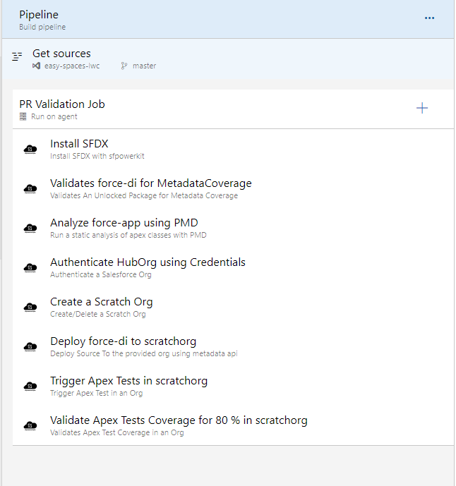

# Pull Request Validation using Scratch Org

[This pipeline](https://raw.githubusercontent.com/azlamsalam/sfpowerscripts/release/SamplePipelines/sfpowerscripts-sample-pipelines/BuildDefinitions/PR%20Source%20Format%20%5BScratch%20Orgs%5D%20using%20sfpowerscripts.json) demonstrates how you can build a pull request validation pipeline using scratch org. Here is a snapshot of the steps we have used to configure a pipeline. The intend of this pipeline is to validate a pull/merge request into the integration branch upon completion of a feature branch by developers.

This pipeline is triggered on every pull request raised against a develop/master branch depending on your git flow.

**Pipeline Snapshot**

You can import and modify this pipeline using the file provide in the [link](https://raw.githubusercontent.com/azlamsalam/sfpowerscripts/release/SamplePipelines/sfpowerscripts-sample-pipelines/BuildDefinitions/PR%20Source%20Format%20%5BScratch%20Orgs%5D%20using%20sfpowerscripts.json)

**Tasks Involved**

The steps that are part of this pipeline are \(in the exact order\)

1. [Install SFDX CLI](../task-specifications/utility-tasks/install-sfdx-cli-with-sfpowerkit.md)
2. [Validate Unlocked Package](https://sfpowerscripts.com/Tasks/Common-Utility-Tasks/Validate%20Unlocked%20Package/) \( Only necessary if you are building an unlocked package\)
3. [Authenticate an Org](../task-specifications/authentication/authenticate-an-org.md)\( In this case, it is authenticating against DevHub\)
4. [Create/Delete a scratch org](../task-specifications/utility-tasks/create-delete-a-scratch-org.md)\( Action :Create\)
5. [Deploy source to scratch org](../task-specifications/deployment-tasks/deploy-a-source-repo-to-org.md) \( Deploy\)
6. [Trigger Apex Tests in the scratch org](../task-specifications/testing-tasks/trigger-apex-test.md)
7. [Validate the apex test coverage in the org](../task-specifications/testing-tasks/validate-apex-test-coverage.md)


This pipeline need to be enabled only with PR triggers, CI triggers for pipeline should be disabled. Follow this  documentation to enable this PR trigger using this [link](https://docs.microsoft.com/en-us/azure/devops/pipelines/build/triggers?view=azure-devops&tabs=classic)


